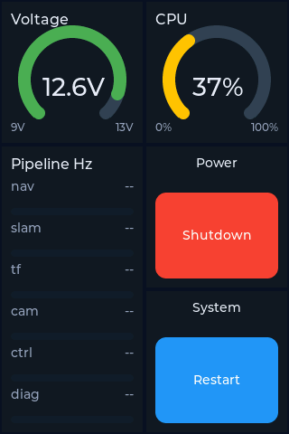

# 16_rovi_dasboard

Simple LVGL dashboard demo for a robot (ROVI), targeting the 3.5" 320×480 ESP32‑S3 Touch LCD.

## What you get

- Grid layout (configured in `data/config.json`, default is 2×3 for 320×480)
  - Voltage arc gauge (multi‑stage coloring)
  - CPU arc gauge
  - Pipeline Hz list (spans 2 tiles via repeated tile id)
  - Shutdown / Restart buttons (serial callbacks)
- Fail‑safe display: if a value is older than `ui.stale_timeout_ms` it shows `--`
- Splash screen (BMP) loaded from internal flash FS (FFat) before showing the dashboard

## Local library

This sample uses two local PlatformIO libraries:

- `lib/WsLcd35S3Hal/` (board/HAL)
  - Brings up Arduino_GFX + touch + LVGL display/input
  - Mounts internal FFat and registers it as LVGL drive `F:`
- `lib/LiveDashboard/` (UI)
  - Loads `/config.json` from internal FFat
  - Builds the tile grid + widgets from config
  - Shows splash from internal FFat (e.g. `F:/rovi.bmp`)

`src/main.cpp` stays minimal:

- Registers callbacks for `shutdown` / `restart`
- Optional JSONL demo replay (from `data/test.jsonl`) enabled via init options
- Serial event ingestion (one JSON line per `\n`)

## Internal config (FFat)

- `data/config.json` and `data/rovi.bmp` are built into the internal flash FATFS partition (`ffat` in `partitions/partitions_16MB_3MBapp_9_9MB_fatfs.csv`).
- `/config.json` is required: if it’s missing or invalid the firmware prints a fatal message and shows a “CONFIG ERROR” screen.

Upload the filesystem image:

- `pio run -e esp32-s3-touch-lcd-35 -t uploadfs`

## Updating values

In `src/main.cpp` the demo uses:

- `g_dashboard.publishGauge("voltage", voltage_x10, "12.1V")`
- `g_dashboard.publishGauge("cpu", cpu_percent, "37%")`
- `g_dashboard.tick()` (called from `loop()` to enforce stale/`--` behavior)

## Demo input (JSONL + Serial)

The sample includes a simple “event replay” demo:

- `data/test.jsonl` is uploaded to internal FFat and can be replayed once per second (loops at EOF).
- You can paste the same JSON lines into the serial monitor; the line is applied when a full newline is received.
- Toggle JSONL replay via `ROVI_ENABLE_JSONL_DEMO_REPLAY` in `src/main.cpp`.
- If JSONL replay is enabled and `/test.jsonl` is missing, the app fails hard and shows an error screen.

Line format:

- Single update: `{"id":"voltage","value":121,"text":"12.1V"}`
- Multiple updates in one line: `[{"id":"voltage","value":121,"text":"12.1V"},{"id":"cpu","value":37,"text":"37%"}]`
- Limits: max line length 1024 chars, max 5 events per line.

## Build (PlatformIO)

From the project folder:

- `pio run -e esp32-s3-touch-lcd-35`
- `pio run -e esp32-s3-touch-lcd-35 -t upload`
